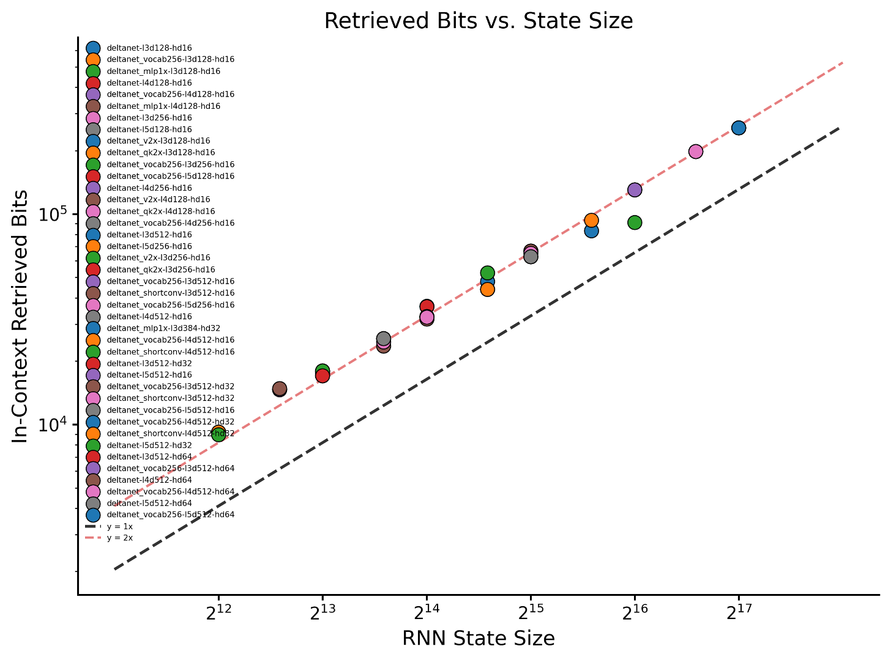

# How much can RNN memorize

Date: March, 2026

Recurrent Neural Networks (RNN) compress in-context information into its hidden states. Given a finite sized hidden states, RNN can only memorize a fixed set of information. One intriguing question is: **how much can an RNN memorize given its fixed state size?**

## The Experiment: Random String Copy-Paste

We measure this through synthetic experiments across several scales, and check if we can measure some consistent patterns. We train RNNs specifically for a simple synthetic task: **random string copy-paste**, where we ask the RNN to read through one random string, and then paste it. Depending on how accurate the model performs on this task with varying length random strings, we can measure how much it can memorize when reading through the random string once.

Example:
```
# Input:  a c b b a a <sep> a c b b a a
# Target: _ _ _ _ _ _   _   a c b b a a
```

By looking at the next-token prediction loss, we can calculate the "Memorized Bits":

$$
\text{Memorized Bits} = N \log(\text{Vocab-Size}) - \sum_i^N \text{loss}_i, 
$$
where the $N$ is the number of random tokens, $\text{Vocab-Size}$ is the size of the random-token vocabulary.tokens. 

## Key Results




I played DeltaNet with several different model specs, with state size from \(2^{12}\) to \(2^{17}\), and get a roughly consistent measurement. The DeltaNet can memorize around **2 bit per state parameter** on this random string copy paste data.

## Discussions: what does 2 bit mean?

The number \(\sim\) 2 bit/state is very unintuitive or even arbitrary. If you're thinking, "Wait, fp32 DeltaNet state has 32 bits per parameter, shouldn't 2 bits be a failure?"—not quite.

Personally, this number seems way higher than my expectation for two reasons. First, it is already quite remarkable that a neural network can store general information in hidden states represented only as rigid matrices of fp32 values.

Second, recent works suggest that pretraining transformer end-to-end can also memorize similar scale of information per model parameter. For example, Physics of Language Models (Allen Zhu et al.) reports that a large transformer can memorize around 2 bits per parameter on synthetic biography data. Another recent work by John Morris reports roughly 3.6 bits per parameter on a different synthetic setup.

Note these are not directly comparable settings. Those results measure how much information a transformer can absorb into its weights through end-to-end gradient descent over many training epochs, sometimes with thousands of exposures to the same data. In contrast, here I am measuring how much information an RNN state can hold within a single forward pass. 
Given this, the exact number does not matter for me, and the important observation seems to be: **the memory capacity of an RNN hidden state seems can be on the same order of magnitude as the memorization capacity achieved by training a model end-to-end.**

## Extra details

To avoid giving a misleading impression, here are a few important details:

1. We do not require exact retrieval during training, and many runs only reach about 30–60% accuracy.
2. Training details matter a lot. In particular, we use mixed-length training, which acts as a curriculum. We mix four different lengths during training from 1/8, 1/4, 1/2, to full sequence length. Also we overtrain the model over trillions of tokens on such simple task (500K iterations with batch size of 256 $\times\$ full sequence length).
3. For each model specification and training length, we run 9 trials in total: 3 learning rates and 3 random seeds. In the figure above, each point shows only the **best** run. The variance across runs is substantial.
4. We used a hybrid structure, with the first layer as a small sliding window attention (window size of 32) to help learning the induction head. And we then stack 2 to 4 DeltaNet layers, with 8 to 16 heads, and head dimensions of 8, 16, 32, or 64. We test vocabulary sizes of 32 and 1024, and the longest sequences contain about 32,768 random tokens.

In short, points (2) and (3) are practical steps to reduce optimization difficulty and variance in this long-context synthetic setting. It is entirely possible that there exist DeltaNet configurations with much higher memory capacity—for example, 10 bits per state parameter—but gradient descent may fail to find them reliably. These choices are meant to reduce that gap between the trained model and a hypothetical oracle solution.

I will organize more experimental details in a future write-up.

## References

[1] Physics of Language Models: Part 3.3, Knowledge Capacity Scaling Laws  
[2] How much do language models memorize?

